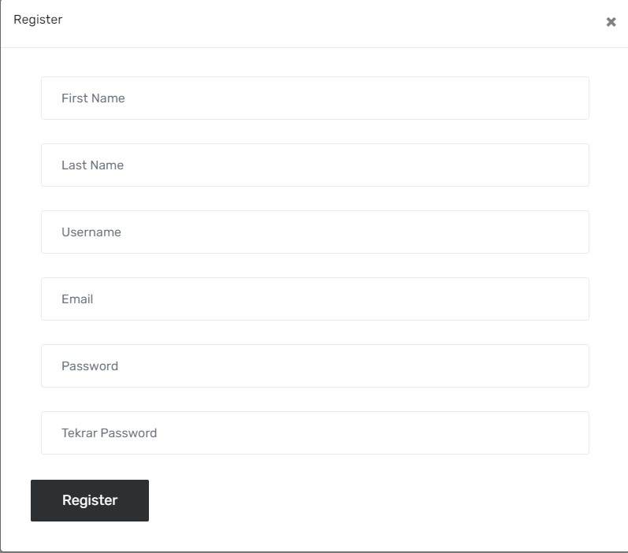
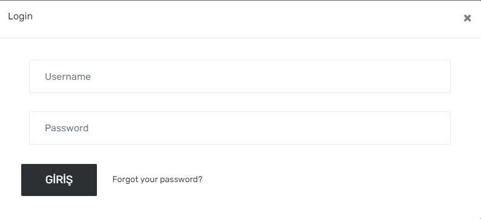
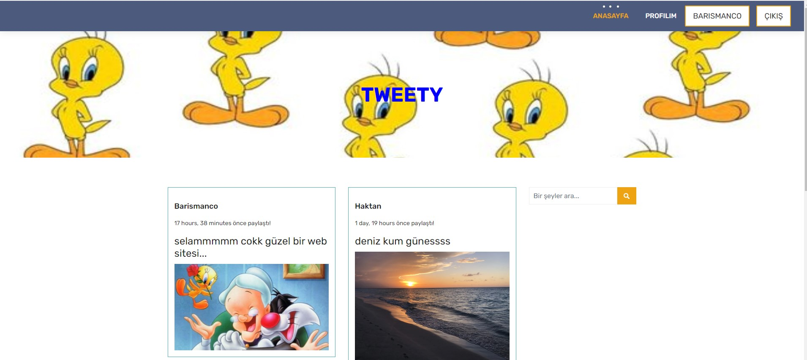
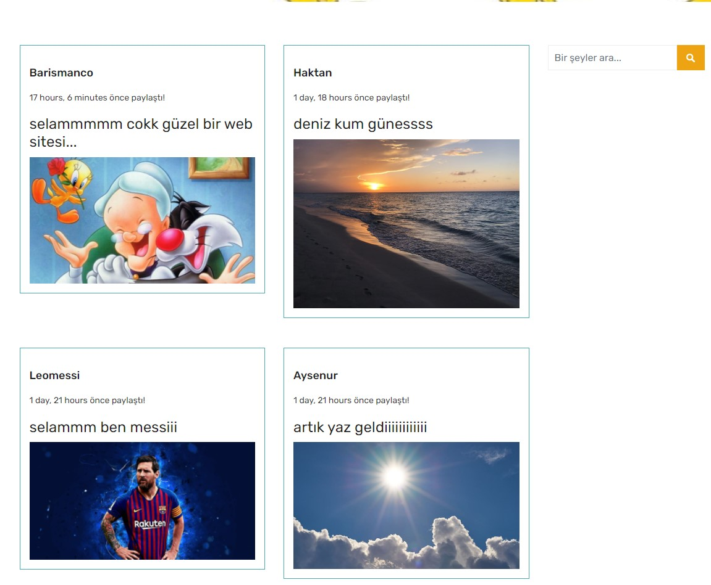
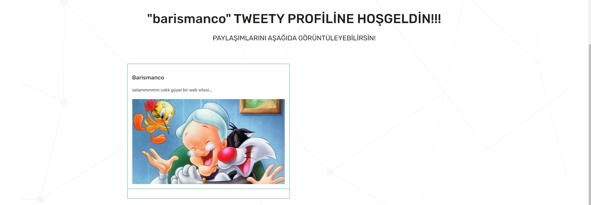
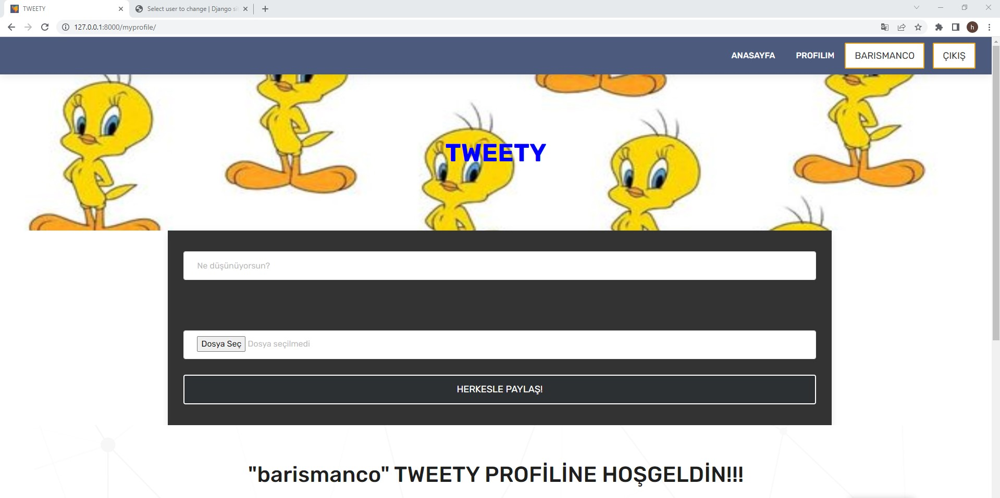

#  PYTHON BACKEND-DJANGO

## Pyhton Django ile bir sosyal medya sitesi çalışması.
### Kullanıcı oluşturulabilir , giriş yapılabilir ve paylaşım yapılabilir. 
### Her üye profilinde kendine ait paylaşımları görür.
### Anasayfada tüm kullanıcıların paylaşımları görülür.
### Anasayfada 'search' özelliği ile gönderi içeriklerine göre arama yapılabilir.
### Her zaman son atılan gönderi en üstte görünür.
### Gönderilerle yüklenen fotoğraflar 'media' klasöründe saklanır.
## NOT: Template dosyalarını hazır dosyaları keserek/düzenleyerek oluşturdum. BACKEND kısmı tamamen bana aittir.
## - BACKEND OLARAK PROJENİN İÇERDİĞİ BAŞLICA ÖZELLİKLER

- # Register 

- # Login

- # Anasayfa

- # Profile

- # Paylaşım Yapma
